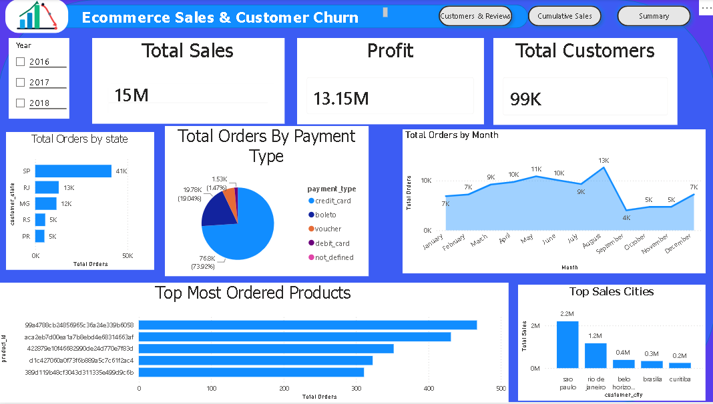
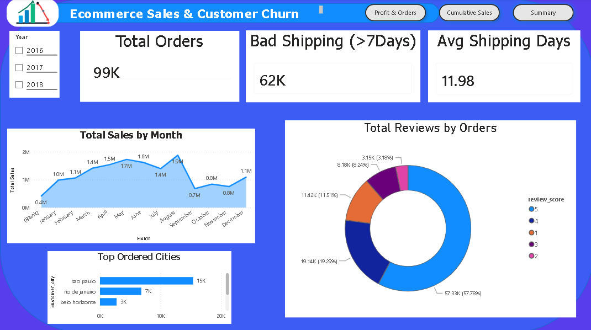
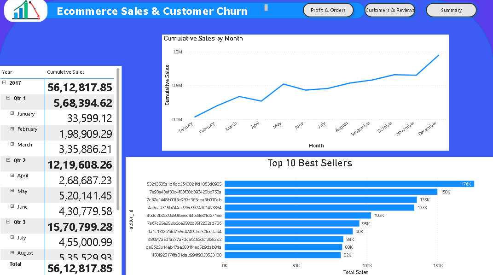
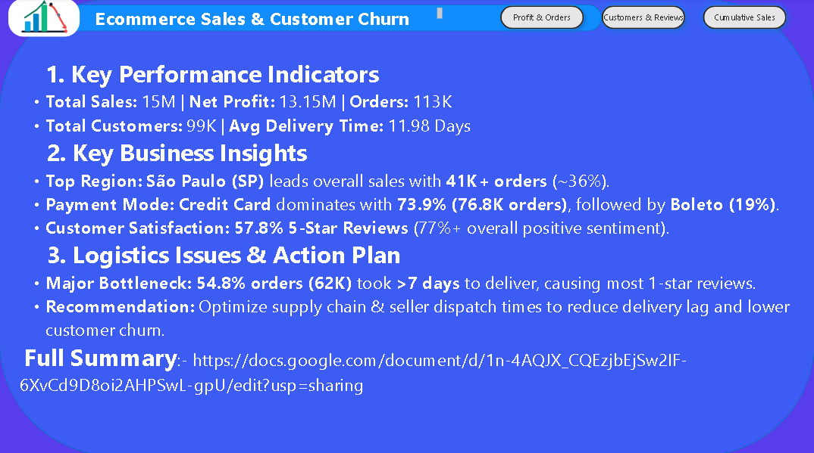

# 📊 Ecommerce Sales & Customer Churn Analysis (Power BI)

## 📌 Project Overview
This project provides an end-to-end analysis of e-commerce performance, delivery logistics, and customer churn dynamics. Built using **Power BI**, the interactive dashboard analyzes over 113K orders across various Brazilian states to uncover revenue drivers, regional demand, and logistics bottlenecks.

---

## 🔑 Key Performance Indicators (KPIs)
* **Total Sales:** $15M
* **Net Profit:** $13.15M
* **Total Customers:** 99K
* **Total Orders:** 113K
* **Average Delivery Time:** 11.98 Days
* **Delayed / Bad Deliveries (>7 Days):** 62K (~54.8% of orders)

---

## 📸 Dashboard Screenshots & Features

### 1. Profit & Orders Overview

* Tracks high-level sales ($15M) and net profit ($13.15M).
* **Top Region:** São Paulo (SP) leads with 41K+ orders (~36%).
* **Payment Methods:** Credit Card dominates (73.9%), followed by Boleto (19.0%).

---

### 2. Customers & Reviews Analysis

* **Customer Sentiment:** 77%+ positive ratings (57.8% 5-Star, 19.3% 4-Star).
* **Delivery Bottleneck:** Identifies shipping delays (>7 days) as the primary factor affecting customer experience.

---

### 3. Cumulative Sales & Best Sellers

* Cumulative revenue progression tracking across months/quarters.
* Highlights the Top 10 Best Sellers driving maximum sales volume.

---

### 4. Key Insights & Summary

* High-level executive overview summarizing core business findings and logistics bottlenecks.

---

## 💡 Business Insights & Recommendations
* **Logistics Optimization:** Over 54% of orders take longer than 7 days to arrive. Partnering with local fulfillment centers in top hubs (like São Paulo and Rio de Janeiro) will lower delivery lag and prevent churn.
* **Payment Optimization:** Provide incentives for instant digital payment methods to decrease settlement delays from Boleto.
* **Seller Management:** Support top-performing sellers with automated inventory sync to avoid stockout issues during peak months.

---

## 🛠️ Tools & Technologies Used
* **Business Intelligence:** Power BI (Power Query, DAX, Data Modeling)
* **Data Source:** E-commerce Transactional Dataset

---

## 🚀 How to View the Project
1. Click on the green **Code** button at the top right of this repository.
2. Select **Download ZIP** and extract the folder.
3. Open the `.pbix` file using **Power BI Desktop**.
